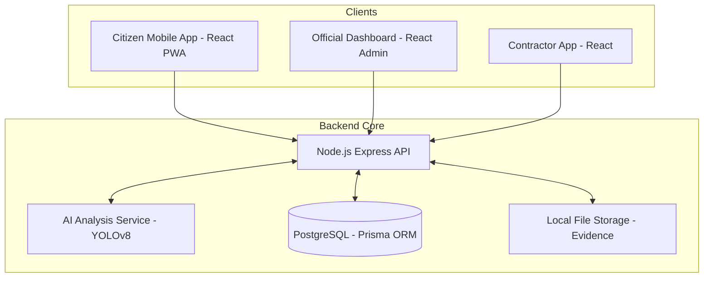

# Smart Road Damage Reporting & Rapid Response System

**A Strategic E-Governance Solution for Solapur Municipal Corporation (SMC)**

---

## 🏗 System Architecture

The system is built on a modular, secure, and self-hosted architecture to ensure data sovereignty and operational resilience.

### Architecture Diagram


---

## 🌟 Key Features

### 1. Governance & Compliance
*   **Strict State Machine**: Enforces a logical workflow: `SUBMITTED` → `VERIFIED` → `ASSIGNED` → `IN_PROGRESS` → `COMPLETED` → `CLOSED`.
*   **Human-in-the-Loop AI**: AI provides advisory severity classification and damage detection, but final decisions remain with municipal officials.
*   **Audit Trail**: Immutable logs capture every state transition, assignment, and rejection for full accountability.
*   **Data Sovereignty**: Entirely self-hosted solution using local storage and PostgreSQL, eliminating reliance on third-party cloud providers.

### 2. Technical Excellence
*   **Advisory AI**: Local YOLOv8 inference for real-time damage analysis without external data exposure.
*   **Mapping**: Leverages OpenStreetMap and Leaflet for cost-effective, high-accuracy geospatial tracking.
*   **Role-Based Access Control (RBAC)**: Secure access tailored for Citizens, Department Officials, and Maintenance Contractors.

---

## 💻 Tech Stack

| Component | Technology |
| :--- | :--- |
| **Backend** | Node.js (Express), Prisma ORM |
| **Frontend** | React (Vite), Tailwind CSS |
| **Artificial Intelligence** | Python (Flask), YOLOv8 |
| **Database** | PostgreSQL |
| **Geospatial** | Leaflet, OpenStreetMap, Nominatim |
| **Infrastructure** | Docker, Docker Compose |

---

## 🚀 Quick Start

### Prerequisites
*   Node.js 20+
*   Python 3.10+
*   Docker & Docker Compose
*   PostgreSQL

### 1. Database & Infrastructure
```bash
docker-compose up -d
```

### 2. Backend Initialization
```bash
cd backend
npm install
cp .env.example .env
npx prisma migrate dev
npm run dev
```

### 3. AI Service Setup
```bash
cd ai-service
python -m venv venv
# Windows
.\venv\Scripts\activate
# Linux/Mac
source venv/bin/activate

pip install -r requirements.txt
python model_server.py
```

### 4. Application Access
*   **Citizen App**: `cd citizen-app && npm install && npm run dev`
*   **Official Dashboard**: `cd official-dashboard && npm install && npm run dev`
*   **Contractor App**: `cd contractor-app && npm install && npm run dev`

---

## 📄 License
This project is developed for the Solapur Municipal Corporation. All rights reserved.


```bash
cd`citizen-app`&&`npm`install`&&`npm`run`dev
#`Citizen`Login:`citizen@test.com`/`password123
cd`official-dashboard`&&`npm`install`&&`npm`run`dev
#`Admin`Login:`admin@solapur.gov.in`/`admin123
```

##``Workflow`&`Statuses

1.`**SUBMITTED**:`Citizen`reports`damage`(Camera`+`GPS`Mandatory).
2.`**VERIFIED**:`Official`reviews`AI`suggestion,`confirms`damage`type/severity.
3.`**ASSIGNED**:`Official`assigns`contractor/department.`
4.`**IN_PROGRESS**:`Repair`work`started.
5.`**COMPLETED**:`Contractor`uploads`"After"`photo`(Camera`only).
6.`**CLOSED**:`Official`verifies`quality`and`closes`ticket.

##``License

Copyright``2026`Solapur`Municipal`Corporation.`All`rights`reserved.


##``AI`Role`&`Governance`Safeguards

The`AI`module`in`this`system`is`strictly`**Advisory`Decision`Support`System`(DSS)**.

1.``**No`Automated`Decisions**:`The`system`**never**`automatically`validates`a`complaint`or`assigns`a`contractor`based`on`AI`output.
2.``**Human-in-the-loop**:`Every`"VERIFIED"`status`change`requires`an`Official`to`explicitly`select`and`confirm`damage`type`and`severity.
3.``**Data`Isolation**:`AI`runs`locally`on`the`server.`No`image`data`is`sent`to`external`cloud`APIs.
4.``**Auditability**:`All`AI`suggestions`are`logged`in`the``AuditLog``table`separately`from`the`Official`s`final`decision.


###`5.`Contractor`App

`ash
cd`contractor-app`&&`npm`install`&&`npm`run`dev
#`Contractor`Login:`contractor@buildwell.com`/`password123
`

###`6.`Demo`Data`Seeding

To`populate`the`database`with`hackathon-ready`data:
`ash
cd`backend
npm`run`seed:demo
`
