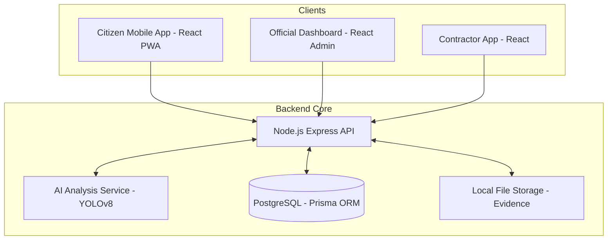

# Smart Road Damage Reporting & Rapid Response System

Developed for the Solapur Municipal Corporation (SMC).

## System Architecture

The system utilizes a modular service architecture designed for performance and data sovereignty.

### Architecture Overview



## Core Features

### Governance and Compliance
- **State Machine Enforcement**: Managed transition workflow from SUBMITTED to CLOSED.
- **Human-in-the-Loop AI**: AI-assisted severity classification with mandatory human verification.
- **Immutable Audit Trail**: Comprehensive logging of all system transactions and state changes.
- **Data Sovereignty**: Fully self-hosted architecture using localized PostgreSQL and file storage.

### Technical Implementation
- **Advisory AI**: Native YOLOv8 inference for damage detection.
- **Geospatial Services**: Leaflet and OpenStreetMap integration for mapping.
- **Granular RBAC**: Role-based access control for multiple organizational tiers.

## Technical Specifications

| Component | Technology |
| :--- | :--- |
| Backend | Node.js (Express), Prisma ORM |
| Frontend | React (Vite), Tailwind CSS |
| AI Analysis | Python (Flask), YOLOv8 |
| Database | PostgreSQL |
| Geospatial | Leaflet, OpenStreetMap |
| Infrastructure | Docker, Docker Compose |

## Installation and Deployment

### Prerequisites
- Node.js 20+
- Python 3.10+
- Docker Engine
- PostgreSQL

### Infrastructure Setup
```bash
docker-compose up -d
```

### Backend Configuration
```bash
cd backend
npm install
cp .env.example .env
npx prisma migrate dev
npm run dev
```

### AI Service Deployment
```bash
cd ai-service
python -m venv venv
# Windows
.\venv\Scripts\activate
# Unix
source venv/bin/activate

pip install -r requirements.txt
python model_server.py
```

### Application Development Servers
- **Citizen App**: `cd citizen-app && npm install && npm run dev`
- **Official Dashboard**: `cd official-dashboard && npm install && npm run dev`
- **Contractor App**: `cd contractor-app && npm install && npm run dev`

## License

This project is proprietary and developed exclusively for the Solapur Municipal Corporation (SMC). Reproduction or unauthorized use without explicit permission is prohibited.
